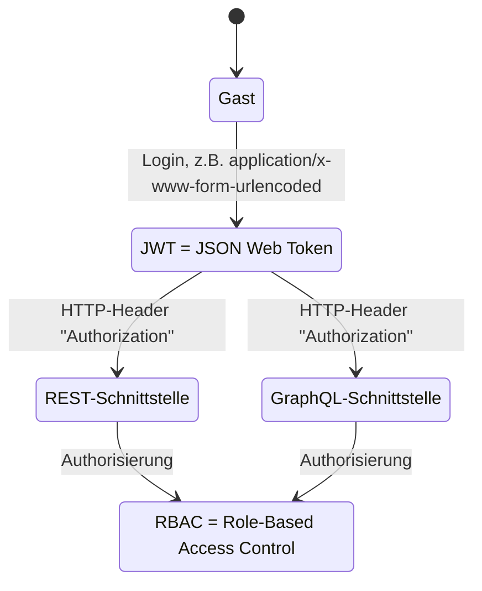

# Hinweise zum Programmierbeispiel

<!--
  Copyright (C) 2020 - present Juergen Zimmermann, Hochschule Karlsruhe

  This program is free software: you can redistribute it and/or modify
  it under the terms of the GNU General Public License as published by
  the Free Software Foundation, either version 3 of the License, or
  (at your option) any later version.

  This program is distributed in the hope that it will be useful,
  but WITHOUT ANY WARRANTY; without even the implied warranty of
  MERCHANTABILITY or FITNESS FOR A PARTICULAR PURPOSE.  See the
  GNU General Public License for more details.

  You should have received a copy of the GNU General Public License
  along with this program.  If not, see <http://www.gnu.org/licenses/>.
-->

[Juergen Zimmermann](mailto:Juergen.Zimmermann@h-ka.de)

> Diese Datei ist in Markdown geschrieben und kann mit `<Strg><Shift>v` in
> Visual Studio Code leicht gelesen werden. Dazu wird die Extension
> _Markdown Preview Mermaid Support_ empfohlen, um UML-Diagramme in der Syntax
> von _Mermaid_ (wie bei PlantUML) visualisieren zu können.
>
> Näheres zu Markdown gibt es z.B. bei [Markdown Guide](https://www.markdownguide.org/)
>
> Nur in den ersten beiden Vorlesungswochen kann es Unterstützung bei
> Installationsproblemen geben.

## Inhalt

- [Download- und ggf. Upload-Geschwindigkeit](#download--und-ggf-upload-geschwindigkeit)
- [Vorbereitung der Installation](#vorbereitung-der-installation)
- [ES Modules (ESM)](#es-modules-(esm))
- [Eigener Namespace in Kubernetes](#eigener-namespace-in-kubernetes)
- [Relationale Datenbanksysteme](#relationale-datenbanksysteme)
  - [PostgreSQL](#postgresql)
  - [MySQL](#mysql)
- [Administration des Kubernetes-Clusters](#administration-des-kubernetes-clusters)
- [Node Best Practices](#node-best-practices)
- [Lokaler Appserver (mit Nest)](#lokaler-appserver-mit-nest)
  - [Entwicklung in einer Powershell](#entwicklung-in-einer-powershell)
  - [OpenAPI](#openapi)
  - [Apollo Sandbox](#apollo-sandbox)
  - [REST Client für eine REST- und eine GraphQL-Schnittstelle](#rest-client-für-eine-rest--und-eine-graphql-schnittstelle)
  - [Postman](#postman)
- [Tests aufrufen](#tests-aufrufen)
- [Deployment in Kubernetes](#deployment-in-kubernetes)
  - [DB-Server als Voraussetzung](#db-server-als-voraussetzung)
  - [Docker-Image durch Buildpacks](#docker-image-durch-buildpacks)
  - [Deployment mit Helm](#deployment-mit-helm)
- [Statische Codeanalyse](#statische-codeanalyse)
  - [ESLint](#eslint)
  - [SonarQube](#sonarqube)
  - [type-coverage](#type-coverage)
- [Sicherheitsanalyse durch snyk](#sicherheitsanalyse-durch-snyk)
- [AsciiDoctor und PlantUML](#asciidoctor-und-plantuml)
  - [Preview von PlantUML-Dateien](#preview-von-plantuml-dateien)
  - [Einstellungen für Preview von AsciiDoctor-Dateien](#einstellungen-für-preview-von-asciidoctor-dateien)
  - [Preview von AsciiDoctor-Dateien](#preview-von-asciidoctor-dateien)
  - [Dokumentation im Format HTML](#dokumentation-im-format-html)
- [Continuous Integration mit Jenkins](#continuous-integration-mit-jenkins)
  - [Aufruf mit Webbrowser](#aufruf-mit-webbrowser)
  - [Bash zur evtl. Fehlersuche im laufenden Jenkins-Container](#bash-zur-evtl-fehlersuche-im-laufenden-jenkins-container)
- [Monitoring durch clinic](#monitoring-durch-clinic)
- [Visual Studio Code](#visual-studio-code)
- [Empfohlene Code-Konventionen](#empfohlene-code-konventionen)

---

## Download- und ggf. Upload Geschwindigkeit

In einem Webbrowser kann man z.B. mit der URL `https://speed.cloudflare.com` die
Download- und die Upload-Geschwindigkeit testen.

Alternativ kann man durch das Kommando `fast` in einer Powershell die aktuelle
Download-Geschwindigkeit ermitteln.

Mit der zusätzlichen Option `--upload` kann zusätzlich die aktuelle
Upload-Geschwindigkeit ermittelt werden.

---

## Vorbereitung der Installation

- Das Beispiel _nicht_ in einem Pfad mit _Leerzeichen_ installieren.
  Viele Javascript-Bibliotheken werden unter Linux entwickelt und dort benutzt
  man **keine** Leerzeichen in Pfaden. Ebenso würde ich das Beispiel nicht auf
  dem  _Desktop_ auspacken bzw. installieren.

- Bei [GitHub](https://github.com) oder [GitLab](https://gitlab.com)
  registrieren, falls man dort noch nicht registriert ist.

---

## ES Modules (ESM)

ESM ist die gängige Abkürzung für _ES Modules_, so dass man `import` und
`export` statt `require()` aus _CommonJS_ verwenden kann. Die Unterstützung von
ESM wurde in Node ab Version 12 begonnen. Außerdem ist es wichtig, das man beim
Umstieg auf ESM auch die Unterstützung in _ts-node_ und _ts-jest_ beachtet.

Wenn man ESM verwendet, muss man die eigenen Module z.B. folgendermaßen
importieren:

```JavaScript
    import { myFunc } from './foo.js';
    import { myClass } from './bar/index.js';
```

Außerdem gibt es ab Node 17.1 das _Node Protocol_ für den Import von
_Builtin Modules_, z.B.:

```JavaScript
    import { resolve } from 'node:path';
```

Gute Literatur zu ESM gibt es bei:

- https://nodejs.org/api/esm.html#esm_node_imports
- https://gist.github.com/sindresorhus/a39789f98801d908bbc7ff3ecc99d99c
- https://docs.joshuatz.com/cheatsheets/node-and-npm/node-esm
- https://www.typescriptlang.org/docs/handbook/esm-node.html
- https://github.com/TypeStrong/ts-node/issues/1007

Unterstützung für ESM ist notwendig in:

- Node
- TypeScript
- ts-node
- ts-jest: versteht noch nicht die Datei-Endung `.mts` und beim Import `.mjs`
- VS Code
- Node innerhalb von Jenkins

## Eigener Namespace in Kubernetes

Genauso wie in Datenbanksystemen gibt es in Kubernetes _keine_ untergeordneten
Namespaces. Vor allem ist es in Kubernetes empfehlenswert für die eigene
Software einen _neuen_ Namespace anzulegen und **NICHT** den Default-Namespace
zu benutzen. Das wurde bei der Installation von Kubernetes durch den eigenen
Namespace `acme` bereits erledigt. Außerdem wurde aus Sicherheitsgründen beim
defaultmäßigen Service-Account das Feature _Automounting_ deaktiviert und der
Kubernetes-Cluster wurde intern defaultmäßig so abgesichert, dass

- über das Ingress-Gateway keine Requests von anderen Kubernetes-Services
  zulässig sind
- über das Egress-Gateway keine Requests an andere Kubernetes-Services zulässig sind.

---

## Relationale Datenbanksysteme

### PostgreSQL

#### Docker Compose für PostgreSQL und pgadmin

Wenn man den eigenen Microservice direkt mit Windows laufen lässt, kann man
PostgreSQL und das Administrationswerkzeug pgadmin einfach mit _Docker Compose_
starten und später auch herunterfahren.

> ❗ Vor dem 1. Start von PostgreSQL muss man in `docker-compose.yaml` im
> Verzeichnis extras\postgres die Zeile mit dem (eingeschränkten) Linux-User
> "postgres:postgres" auskommentieren, damit die Initialisierung von PostgreSQL
> als Linux-User `root` ausgeführt werden kann. Danach kopiert man die Skripte
> `create-db-buch.sh` und `create-db-buch.sql` aus dem Verzeichnis
> `extras\postgres\sql` nach `C:\Zimmermann\volumes\postgres\sql`.
> Für die Windows-Verzeichnisse `C:\Zimmermann\volumes\postgres\data`,
> `C:\Zimmermann\volumes\postgres\tablespace` und
> `C:\Zimmermann\volumes\postgres\tablespace\buch` muss außerdem Vollzugriff
> gewährt werden, was über das Kontextmenü mit _Eigenschaften_ und den
> Karteireiter _Sicherheit_ für die Windows-Gruppe _Benutzer_ eingerichtet
> werden kann. Nun kann man das Auskommentieren des eingeschränkten Linux-Users
> in `docker-compose.yaml` wieder rückgängig machen, damit der DB-Server fortan
> nicht als Superuser "root" läuft.
> Übrigens ist das Emoji für das Ausrufezeichen von https://emojipedia.org.

```powershell
    cd extras\postgres
    docker compose up

    # Herunterfahren in einer 2. Shell:
    cd extras\postgres
    docker compose down
```

Der Name des Docker-Containers lautet `postgres` und ebenso lautet der
_virtuelle Rechnername_ `postgres`. Der virtuelle Rechnername `postgres`
wird später auch als Service-Name für PostgreSQL in Kubernetes verwendet.

> ❗ Nach dem 1. Start des PostgreSQL-Servers muss man einmalig den
> Datenbank-User `buch` und dessen Datenbank `buch` anlegen, d.h. der neue
> Datenbank-User `buch` wird zum Owner der Datenbank `buch`. Dazu muss man
> sich mit dem Docker-Container mit Namen `postgres` verbinden und im
> Docker-Container das `bash`-Skript ausführen:

```powershell
    docker compose exec postgres sh
       psql --dbname=postgres --username=postgres --file=/sql/create-db-kunde.sql
```

Außerdem kann _pgadmin_ zur Administration verwendet werden. pgadmin läuft
ebenfalls als Docker-Container und ist über ein virtuelles Netzwerk mit dem
Docker-Container des DB-Servers verbunden. Deshalb muss beim Verbinden mit dem
DB-Server auch der virtuelle Rechnername `postgres` verwendet werden. Man ruft
also pgadmin mit Chrome und der URL `http://localhost:8888` auf.
Die Emailadresse `pgadmin@acme.com` und das Passwort `p` sind voreingestellt.
Da pgadmin mit Chromium implementiert ist, empfiehlt es sich, Chrome als
Webbrowser zu verwenden.

Beim 1. Einloggen konfiguriert man einen Server-Eintrag mit z.B. dem Namen
`postgres-container` und verwendet folgende Werte:

- Host: `postgres` (virtueller Rechnername des DB-Servers im Docker-Netzwerk.
  **BEACHTE**: `localhost` ist im virtuellen Netzwerk der Name des
  pgadmin-Containers selbst !!!)
- Port: `5432` (Defaultwert)
- Username: `postgres` (Superuser beim DB-Server)
- Password: `p`

Es empfiehlt sich, das Passwort abzuspeichern, damit man es künftig nicht jedes
Mal beim Einloggen eingeben muss.

#### Skaffold für PostgreSQL und pgadmin

Wenn der eigene Server in Kubernetes gestartet werden soll (s.u.), muss
_PostgreSQL_ zuvor in Kubernetes gestartet werden, was mit _Skaffold_ gemacht
werden kann. Wenn die Umgebungsvariable `SKAFFOLD_PROFILE` auf den Wert `dev`
gesetzt ist, dann wird das Profile `dev` verwendet, welches bei Helm zusätzlich
die Datei `dev.yaml` verwendet. Bis das Port-Forwarding aktiviert ist, das in
`skaffold.yaml` konfiguriert ist, muss man ein bisschen warten.

```powershell
    cd extras\postgres
    skaffold dev --no-prune=false --cache-artifacts=false
    <Strg>C
    skaffold delete
```

Dabei wurde auch das Administrationswerkzeug _pgadmin_ innerhalb von Kubernetes
gestartet und kann wegen Port-Forwarding mit `http://localhost:8888` aufgerufen
werden.

Mit `<Strg>C` kann das Deployment wieder zurückgerollt werden. Ohne die beiden
Optionen muss man noch manuell die 4 _PersistentVolumeClaim_ mit den Namen
`postgres-data-volume-postgres-0`, `postgres-conf-volume-postgres-0`,
`pgadmin-pgadmin-volume-pgadmin-0` und `pgadmin-pgadmin4-volume-pgadmin-0`
löschen, die durch die _StatefulSet_ `postgres` und `pgadmin` erstellt wurden.
Dazu gibt es das PowerShell-Skript `delete-pvc.ps1` im Verzeichnis
`extras\postgres`.

#### helmfile für PostgreSQL und pgadmin

Statt _Skaffold_ kann man auch _helmfile_ mit manuellem Port-Forwarding verwenden:

```powershell
    cd extras\postgres
    helmfile apply
    .\port-forward.ps1

    # Deinstallieren
    helmfile destroy
    .\delete-pvc.ps1
```

### MySQL

#### Docker Compose für MySQL und phpMyAdmin

Wenn man den eigenen Microservice direkt mit Windows - nicht mit Kubernetes -
laufen lässt, kann man MySQL und das Administrationswerkzeug phpMyAdmin einfach
mit _Docker Compose_ starten und später auch herunterfahren.

> ❗ Vor dem 1. Start von MySQL muss man die Skripte `create-db-buch.sh` und
> `create-db-buch.sql` aus dem Projektverzeichnis
> `extras\mysql\sql` nach `C:\Zimmermann\volumes\mysql\sql` kopieren.

```powershell
    cd extras\mysql
    docker compose up

    # Herunterfahren in einer 2. Shell:
    cd extras\mysql
    docker compose down
```

Der Name des Docker-Containers und des _virtuellen Rechners_ lautet `mysql`.
Der virtuelle Rechnername wird später auch als Service-Name für MySQL in
Kubernetes verwendet.

> ❗ Nach dem 1. Start des DB-Servers muss man einmalig den Datenbank-User
> `buch` und dessen Datenbank `buch` anlegen, d.h. der neue Datenbank-User
> `buch` wird zum Owner der Datenbank `buch`. Dazu muss man sich mit dem
> Docker-Container mit Namen `mysql` verbinden und im Docker-Container das
> `bash`-Skript ausführen:

```powershell
    docker compose exec mysql sh
        mysql --user=root --password=p < /sql/create-db-kunde.sql
```

Jetzt läuft der DB-Server. Außerdem kann _phpMyAdmin_ zur Administration
verwendet werden. phpMyAdmin läuft ebenfalls als Docker-Container und ist über
ein virtuelles Netzwerk mit dem Docker-Container des DB-Servers verbunden.
Deshalb muss beim Verbinden mit dem DB-Server auch der virtuelle Rechnername
`mysql` verwendet werden. Man ruft also phpMyAdmin mit einem Webbrowser und der
URL `http://localhost:8889` auf. Zum Einloggen verwendet folgende Werte:

- Server: `mysql` (virtueller Rechnername des DB-Servers im Docker-Netzwerk.
  **BEACHTE**: `localhost` ist im virtuellen Netzwerk der Name des
  phpMyAdmin-Containers selbst !!!)
- Benutzername: `root` (Superuser beim DB-Server)
- Password: `p`

#### Skaffold für MySQL und phpMyAdmin

Wenn der eigene Server in Kubernetes gestartet werden soll (s.u.), muss
_MySQL_ zuvor in Kubernetes gestartet werden, was mit _Skaffold_ gemacht werden
kann. Wenn die Umgebungsvariable `SKAFFOLD_PROFILE` auf den Wert `dev`
gesetzt ist, dann wird das Profile `dev` verwendet, welches bei Helm zusätzlich
die Datei `dev.yaml` verwendet. Bis das Port-Forwarding aktiviert ist, das in
`skaffold.yaml` konfiguriert ist, muss man ein bisschen warten.

```powershell
    cd extras\mysql
    skaffold dev --no-prune=false --cache-artifacts=false
```

Dabei wurde auch das Administrationswerkzeug _phpMyAdmin_ innerhalb von Kubernetes
gestartet und kann wegen Port-Forwarding mit `http://localhost:8889` aufgerufen
werden.

Mit `<Strg>C` kann das Deployment wieder zurückgerollt werden. Ohne die beiden
Optionen muss man noch manuell das _PersistentVolumeClaim_ mit den Namen
`mysql-db-volume-mysql-0` löschen, das durch das _StatefulSet_ `mysql` erstellt
wurde. Dazu gibt es das PowerShell-Skript `delete-pvc.ps1` im Verzeichnis
`extras\mysql`.

#### helmfile für MySQL und phpMyAdmin

Statt _Skaffold_ kann man auch _helmfile_ mit manuellem Port-Forwarding verwenden:

```powershell
    cd extras\mysql
    helmfile apply
    .\port-forward.ps1

    # Deinstallieren
    helmfile destroy
    .\delete-pvc.ps1
```

## Administration des Kubernetes-Clusters

Zur Administration des Kubernetes-Clusters ist für Entwickler*innen m.E. _Lens_
von Mirantis oder _Octant_ von VMware Tanzu oder _Kui_ von IBM gut geeignet.

---

## Node Best Practices

Sehr empfehlenswert ist https://github.com/goldbergyoni/nodebestpractices

---

## Lokaler Appserver (mit Nest)

### Entwicklung in einer Powershell

Durch `npm run start:dev` wird der Appserver im _Watch_-Modus für die
Entwicklung gestartet, d.h. bei Code-Änderungen wird der Server automatisch
neu gestartet.

Beim Starten des Appservers wird außerdem mit _TypeORM_ auf die Datenbank
zugegriffen. Der Benutzername und das Passwort sind in der Datei
`src\config\db.ts` auf `admin` und `p` voreingestellt. Bei Kubernetes muss
_Port-Forwarding_ (s.o.) aktiviert sein. Dazu muss die Umgebungsvariable
`DB_HOST` in `.env` auskommentiert sein oder auf den Defaultwert `localhost`
gesetzt sein. Durch die Umgebungsvariable `DB_POPULATE` wird festgelegt, ob die
(Test-) DB `acme` neu geladen wird.

### OpenAPI

Duch Decorators `@Api...()` kann man _OpenAPI_ (früher: Swagger) in den
Controller-Klassen und -Methoden konfigurieren und dann in einem Webbrowser mit
`https://localhost:3000/swagger` aufrufen. Die _Swagger JSON Datei_ kann man mit
`https://localhost:3000/swagger-json` aufrufen.

### Apollo Sandbox

Ab _Apollo 3_, das auch intern in Nest verwendet wird, gibt es _Apollo Sandbox_,
das man z.B. mit Chrome nutzen kann. Dabei empfiehlt es sich die
Chrome-Erweiterung _Apollo Client DevTools_ von
https://chrome.google.com/webstore/detail/apollo-client-developer-t/jdkknkkbebbapilgoeccciglkfbmbnfm
zu installieren. Apollo Sandbox kann man dann mit der URL
`https://studio.apollographql.com/sandbox/explorer` aufrufen.

Um effizient mit Apollo Sandbox zu arbeiten, empfiehlt es sich, dass man sich
dort registriert, damit man z.B. Autovervollständigen nutzen kann. Für das
Programmierbeispiel kann man beim Registrieren z.B. folgende Daten eingegeben:

- _Graph title_: `Buch`
- _Graph type_: `Development` angeklickt
- _Endpoint_: https://localhost:3000/graphql

Abschließend klickt man dann den Button _Create Graph_ an.

Beispielhafte _Queries_ und _Mutations_ für GraphQL gibt es in den Dateien
`extras\restclient\graphql\buch.query.http` und
`extras\restclient\graphql\buch.mutation.http`.

In der Sandbox kann man z.B. folgende Query absetzen:

...
{
  buch(id: "000000000000000000000001") {
    titel
    art
    isbn
    version
  }
}
...

Oder unter Verwendung von einer Variablen (hier: `buchId`):

...
query ($buchId: ID!) {
  buch(id: $buchId) {
    titel
    art
    isbn
    version
  }
}
...

Dazu muss man im unteren Abschnitt _Variables_ folgendes eintragen:

...
{
  "buchId": "000000000000000000000001"
}
...

Außerdem bietet Nest für eine GraphQL-Schnittstelle in einem Webbrowser die URL
`https://localhost:3000/graphql` an, mit der man auf _Playground_ zugreifen kann,
der allerdings ab _Apollo 3_ deprecated ist.

### REST Client für eine REST- und eine GraphQL-Schnittstelle

Im Unterverzeichnis `extras\restclient` befinden sich in den Unterverzeichnissen
`rest` und `graphql` mehrere Dateien mit der Extension `.rest` oder `.http`.
In diesen Dateien sind Interaktionsmöglichkeiten für die REST- und die
GraphQL-Schnittstelle.

Wenn man eine dieser Dateien in VS Code öffnet, dann sieht man bei jedem
Beispiel bzw. Abschnitt, der mit `###` beginnt, eine künstliche Zeile mit
_Send Request_ (keine Zeilennummer!). Auf _Send Request_ kann man klicken und
der Request wird ausgeführt, wozu natürlich der Server erfolgreich gestartet
sein sollte.

Für den REST-Client benötigt man unterschiedliche Umgebungen (_Environment_) je
nachdem, ob der Server lokal oder in einem (lokalen) Kubernetes-Cluster läuft.
Verschiedene Umgebungen können prinzipiell die gleichen Eigenschaften, aber mit
verschiedenen Werten haben. Beispielsweise lautet die URL für die
REST-Schnittstelle beim lokalen Server `https://localhost:3000/...`
aber im Kubernetes-Cluster `http://localhost:3000/...`. Dazu kann man im
Unterverzeichnis `.vscode` die Datei `settings.json` bearbeiten.

Wenn man von nun an eine `.rest`-Datei öffnet, dann sieht man rechts unten in
der Statusleiste die aktuelle Umgebung. Sobald man rechts unten auf den Namen
der aktuellen Umgebung (oder _No Environment_) klickt, erscheinen die möglichen
Umgebungen in der Auswahl am oberen Fensterrand.

Wenn für die Interaktion mit dem Server Zugriffsberechtigungen erforderlich sind,
muss man sich zunächst einloggen und erhält dabei einen (Access-) Token, und
zwar einen _JWT_ (= JSON Web Token), so dass "stateless sessions" möglich sind.
Nach dem Einloggen kann man den JWT wiederholt verwenden, ohne jedes Mal den
Benutzernamen und vor allem das Passwort mitschicken zu müssen - bis zum
Ablaufen des Tokens. In der _Payload_ ("Nutzdaten") eines Tokens (siehe
https://jwt.io) sind Informationen zum jeweiligen User, so dass dessen Rollen
ermittelt werden können, um damit auf der Serverseite die Zugriffsberechtigungen
anhand der Rollen zu ermitteln (_RBAC_ = "Role-Based Access Controll").

<!-- https://github.com/kamiazya/typedoc-plugin-mermaid/issues/616 -->



Für die Query-Sprache von GraphQL bietet der REST Client allerdings **KEIN**
Autovervollständigen an, wie man es von _Apollo Sandbox_ und _Playground_ (s.o.)
gewohnt ist.

### Postman

Als Alternative zu _REST Client_ als Plugin für VS Code kann man auch die
Desktop-Applikation _Postman_ nutzen: https://www.postman.com.

---

## Tests aufrufen

Folgende Voraussetzungen müssen oder sollten erfüllt sein:

- Der DB-Server muss gestartet sein.
- Port-Forwarding muss für den DB-Server aktiviert sein, z.B. durch `skaffold dev`.
- Der Appserver muss _nicht gestartet_ sein.
- In `.env` kann man die Umgebungsvariable `LOG_DEFAULT` auf `true` setzen,
  um nicht zu detailliert zu protokollieren bzw. damit die Log-Ausgabe
  übersichtlich bleibt.

Nun kann man die Tests folgendermaßen in einer Powershell aufrufen:

```powershell
    npm t
```

Bei der Fehlersuche ist es ratsam, nur eine einzelnen Testdatei aufzurufen,
z.B.:

```powershell
    npm exec jest --detectOpenHandles --errorOnDeprecated `
      --forceExit --runTestsByPath '__tests__\buch\buch-get.controller.test.ts'
```

---

## Deployment in Kubernetes

### DB-Server als Voraussetzung

Voraussetzung für das Deployment des Microservice ist, dass der DB-Server
erfolgreich gestartet ist (s.o.).

### Docker-Image durch Buildpacks

Mittels _(Cloud Native) Buildpacks_ und der Konfigurationsdatei `project.toml`
kann man ein Docker Image erstellen, ohne dass ein Dockerfile erforderlich ist.
Das resultierende Image basiert auf _Ubuntu_ und erfordert, dass die
TypeScript-Dateien in JavaScript übersetzt sind. Durch das npm-Skript `pack`
wird das Docker-Image `docker.io/juergenzimmermann/buch:1.0.0` mit dem implizit
übersetzten JavaScript-Code gebaut:

```powershell
    # In der 2. PowerShell
    npm run pack
```

Wie das Docker-Image gebaut wurde, kann man anschließend mit folgendem Kommando
inspizieren:

```powershell
    pack inspect juergenzimmermann/buch:1.0.0
```

### Deployment mit Helm

Im Verzeichnis `extras\helm` ist ein Helm-Chart für die Entwicklung des
Appservers. Wenn das Docker-Image erstellt ist (s.o.), kann die Installation in
Kubernetes durchgeführt werden mit

- `helm install buch . -f values.yaml -f dev.yaml` in `extras\helm`
- `helmfile apply` mittels `helmfile.yaml` im Wurzelverzeichnis
- `skaffold dev` mittels `skaffold.yaml` im Wurzelverzeichnis

Mit _Lens_ oder _Octant_ kann man anschließend die Installation inspizieren.
Dabei wird die Logdatei im internen Verzeichnis `/var/log/node` angelegt,
welches durch _Mounting_ dem Windows-Verzeichnis `C:\Zimmermann\volumes\buch`
entspricht und mit _Schreibberechtigung_ existieren muss.

Außerdem kann man in `extras\helm` eine Datei `README.md` generieren, die
die Default-Konfigurationswerte für die Helm-basierte Installation enthält.
Dazu ruft man in `extras\helm` das Kommando `helm-docs` auf.

Die Installation kann entsprechend der oben gewählten Installationsvariante
wieder aus Kubernetes entfernt werden:

- `helm uninstall buch` in `extras\helm`
- `helmfile destroy` im Wurzelverzeichnis
- `skaffold delete` bei `skaffold dev`

---

## Statische Codeanalyse

### ESLint

_ESLint_ wird durch folgendes npm-Skript ausgeführt:

```powershell
    npm run eslint
```

### SonarQube

Für eine statische Codeanalyse durch _SonarQube_ muss zunächst der
SonarQube-Server mit _Docker Compose_ als Docker-Container gestartet werden:

```powershell
    cd extras\sonarqube
    docker compose up
```

Wenn der Server zum ersten Mal gestartet wird, ruft man in einem Webbrowser die
URL `http://localhost:9000` auf. In der Startseite muss man sich einloggen und
verwendet dazu als Loginname `admin` und ebenso als Password `admin`. Danach
wird man weitergeleitet, um das initiale Passwort zu ändern. Das neue Passwort
trägt man dann in das Skript `sonar-scanner.ps1` im Wurzelverzeichnis ein.
Zur Konfiguration für künftige Aufrufe des _SonarQube-Scanners_ trägt man jetzt
noch in der Konfigurationsdatei `sonar-project.properties` den Projektnamen beim
der Property `sonar.projectKey` ein.

Nachdem der Server gestartet ist, wird der SonarQube-Scanner in einer zweiten
PowerShell mit dem Skript `sonar-scanner.ps1` gestartet. Das Resultat kann dann
in der Webseite des zuvor gestarteten Servers über die URL `http://localhost:9000`
inspiziert werden.

Abschließend wird der oben gestartete Server heruntergefahren.

```powershell
    cd extras\sonarqube
    docker compose down
```

### type-coverage

Mit `type-coverage` kann man ermitteln, wo im TypeScript-Code `any` verwendet
wurde:

```powershell
    npm run type-coverage
```

---

## Sicherheitsanalyse durch snyk

Zunächst muss man sich bei https://app.snyk.io/account registrieren und dort
auch einen Token besorgen. Danach kann man sich folgendermaßen authentifizieren
und das Projekt auf Sicherheitslücken überprüfen

```powershell
    synk auth <MEIN_TOKEN>
    snyk test
```

## AsciiDoctor und PlantUML

Mit AsciiDoctor und PlantUML ist die Dokumentation geschrieben.

### Preview von PlantUML-Dateien

Durch das Tastaturkürzel `<Alt>d`. Dazu ist eine Internet-Verbindung notwendig.
Beispiele für PlantUML und AsciiDoctor sind im Unterverzeichnis `extras\doc`.

### Einstellungen für Preview von AsciiDoctor-Dateien

Zunächst müssen einmalig die Einstellungen (_Settings_) von VS Code geändert
werden. Dazu geht man über zum Menüpunkt _Datei > Einstellungen > Einstellungen_
und gibt im Suchfeld `asciidoc.use_kroki` ein. Nun setzt man den Haken bei
_Enable kroki integration to generate diagrams_.

Wenn man zum ersten Mal eine `.adoc`-Datei im Editor öffnet, muss man noch
die Verbindung zum PlantUML-Server zulassen, damit die eingebundenen
`.puml`-Dateien in `.svg`-Dateien konvertiert werden. Dazu gibt man zunächst
das `<F1>` ein und schickt im Eingabefeld das Kommando
_AsciiDoc: Change Preview Security Settings_ durch `<Enter>` ab.
Danach wählt man den Unterpunkt _Allow insecure content_ aus.

### Preview von AsciiDoctor-Dateien

Durch das Tastaturkürzel `<Strg><Shift>v`. Dazu ist eine Internet-Verbindung
notwendig.

### Dokumentation im Format HTML

Die Dokumentation im Format HTML wird in einer Powershell folgendermaßen
im Verzeichnis `extras\doc\html` erstellt:

```powershell
    npm run asciidoc
```

## Continuous Integration mit Jenkins

Jenkins wird nicht in Kubernetes, sondern direkt mit _Docker Compose_
genutzt. Dadurch muss Jenkins nicht immer laufen und kann bei Bedarf gestartet
und wieder heruntergefahren werden. Dazu muss zunächst das Jenkins-Image um eine
Docker-Installation ergänzt werden, wozu es das Dockerfile `jenkins.dockerfile`
gibt, um ein solches Image zu erstellen:

```powershell
    Get-Content jenkins.dockerfile | docker run --rm --interactive hadolint/hadolint:2.10.0-beta-debian
    docker buildx build --tag juergenzimmermann/jenkins:1.0.0 . --file jenkins.dockerfile
```

Das neu gebaute Image `juergenzimmermann/jenkins:1.0.0` wird in der
Konfigurationsdatei wird `jenkins.yaml` für Docker Compose verwendet:

```powershell
    docker compose -f jenkins.docker-compose.yaml up
    ...
    # In einer 2. PowerShell: Herunterfahren
    docker compose -f jenkins.docker-compose.yaml down
```

### Aufruf mit Webbrowser

Mit der URL https://localhost:7070 kann man von einem Webbrowser auf das
Jenkins-Image zugreifen. Der Benutzername ist `admin` und das Passwort
`Inf und WI.`.

### Bash zur evtl. Fehlersuche im laufenden Jenkins-Container

```powershell
    docker compose -f jenkins.yaml exec jenkins bash
```

## Monitoring durch clinic

Für Monitoring kann man z.B. `clinic` nutzen, indem man zunächst dem TypeScript-Compiler
durch `npm run tsc` aufruft und danach `npm run clinic`.

Allerdings gibt es noch das offene Ticket
https://github.com/clinicjs/node-clinic-doctor/issues/304

## Visual Studio Code

[Visual Studio Code](https://code.visualstudio.com/Download) kann man
kostenfrei herunterladen.

> Tipps:
>
> - `<Strg>kc` : Markierte Zeilen werden auskommentiert (wie bei Visual Studio)
> - `<Strg>ku` : Bei markierten Zeilen wird der Kommentar entfernt
> - `<F1>`: Die Kommandopalette erscheint
> - `<Strg><Shift>v`: Vorschau für MarkDown und AsciiDoctor
> - `<Alt>d`: Vorschau für PlantUml

## Empfohlene Code-Konventionen

In Anlehnung an die
[Guidelines von TypeScript](https://github.com/Microsoft/TypeScript/wiki/Coding-guidelines)

- "Feature Filenames", z.B. buch.service.ts
- Klassennamen mit PascalCase
- Union-Types (mit Strings) statt Enums
- Attribute und Funktionen mit camelCase
- private Properties _nicht_ mit vorangestelltem **\_**
- Interfaces _nicht_ mit vorangestelltem **I**
- _Barrel_ für häufige Imports, z.B.
  - `config\index.ts` erstellen:

```javascript
    export * from './bar';
    export * from './foo';
```

- einfaches Importieren:

```javascript
    import { Bar, Foo } from 'config';
```

- [...].`forEach`(), [...].`filter`() und [...].`map`() statt for-Schleife
- Arrow-Functions statt function()
- `undefined` verwenden und nicht `null`
- Geschweifte Klammern bei if-Anweisungen
- Maximale Dateigröße: 400 Zeilen
- Maximale Funktionsgröße: 75 Zeilen
